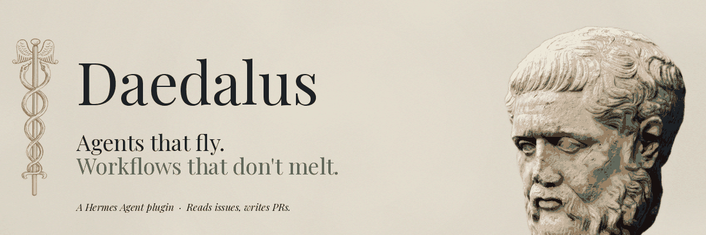

<div align="center">



<br>

**The durable thread for your agents' workflows.**

*Daedalus the craftsman built the Labyrinth, gave Theseus the thread, and warned Icarus not to fly too close to the sun.*

*This Daedalus does the orchestration version of all three.*

<br>

[Architecture](docs/architecture.md) · [Concepts](docs/concepts/) · [Operator](docs/operator/cheat-sheet.md) · [ADRs](docs/adr/)

</div>

---

## What it is

Daedalus runs your agent workflows reliably, 24/7. You describe the work — its stages, hand-offs, and definition of "done". Daedalus turns it into a system that ships. The first workflow we ship and dogfood is **Code-Review** (`Issue → Code → Review → Merge`). More are coming.

## Three myths, three guarantees

<table>
<tr>
<td width="33%" valign="top">

### 🧵 The thread

One owner per lane. A heartbeat keeps the thread taut. If the holder dies mid-flight, another instance picks it up on the next tick — work never gets dropped or duplicated.

→ [Leases & heartbeats](docs/concepts/leases.md)

</td>
<td width="33%" valign="top">

### 🌀 The labyrinth

Every lane walks a clear path through the workflow — picked, coded, reviewed, shipped. State is tracked, not guessed. You always know where each issue is and how it got there.

→ [Lanes](docs/concepts/lanes.md) · [Events](docs/concepts/events.md)

</td>
<td width="33%" valign="top">

### 🪶 The wings

Daedalus warned Icarus, then flew home. Edits to your workflow rules take effect on the next tick — and a bad edit never crashes the loop, it just gets ignored until you fix it. Wedged workers get cleaned up automatically.

→ [Hot-reload](docs/concepts/hot-reload.md) · [Stalls](docs/concepts/stalls.md)

</td>
</tr>
</table>

## What's in the box

- **Configurable agent per role.** Pick which agent and model handles each role in your workflow — Codex for review, Claude for code, your own agent for merge. Set in `workflow.yaml`.
- **Hot-reload.** Edit `workflow.yaml` and the next tick picks it up. Bad edits don't crash the loop; they get ignored until you fix them.
- **Stall detection.** Wedged agents get terminated automatically and the lane retries. No zombie workers.
- **Symphony-aligned event vocabulary** — events follow the [openai/symphony](https://github.com/openai/symphony) taxonomy, so observability tools work across systems.
- **Operator commands** — `/daedalus status`, `shadow-report`, `doctor`, `iterate-active`.
- **Live status dashboard** — ships separately as a Hermes-Agent watch plugin.

## Install

```bash
# 1. Get the code
git clone https://github.com/attmous/daedalus.git
cd daedalus

# 2. Drop it into your Hermes home
./scripts/install.sh                                  # default Hermes home
./scripts/install.sh --hermes-home /path/to/hermes-home
./scripts/install.sh --destination /tmp/daedalus      # explicit destination
```

The installer copies the plugin payload only — no packaging theater.

## Quick start

```bash
./scripts/install.sh --destination /tmp/daedalus
export HERMES_ENABLE_PROJECT_PLUGINS=true
cd <project-root>
hermes
```

Inside Hermes:

```text
/daedalus status
/daedalus shadow-report
/daedalus doctor
```

The full operator surface is documented in the [operator cheat sheet](docs/operator/cheat-sheet.md). Direct `runtime.py` invocations (for debugging without the Hermes shell) live in the [slash commands catalog](docs/operator/slash-commands.md).

## Philosophy

- **The thread, not the loom.** Daedalus runs the loop. Your wrapper picks the next thread.
- **State is tracked, not guessed.** Never reconstruct what's happening from prompt context.
- **Crash is a bug, not a strategy.** Bad config skips dispatch; reconciliation never stops.
- **`--json` is the default operator dialect.** Humans read formatters, scripts read JSON.
- **No packaging theater.** This is a plugin payload. Flat top level, on purpose.

## Where to read next

| Audience | Start here |
|---|---|
| New operator | [docs/operator/cheat-sheet.md](docs/operator/cheat-sheet.md) |
| New contributor | [docs/architecture.md](docs/architecture.md) → [docs/concepts/](docs/concepts/) |
| Workflow author | [docs/concepts/runtimes.md](docs/concepts/runtimes.md) |
| Decision archaeologist | [docs/adr/](docs/adr/) |

## License

MIT — see [LICENSE](LICENSE).

<div align="center">
<sub>Daedalus is a Hermes plugin. Hermes is the messenger; Daedalus is the loom.</sub>
</div>
