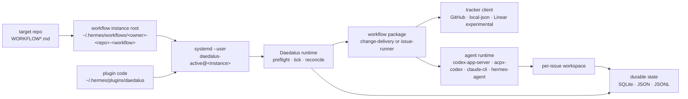
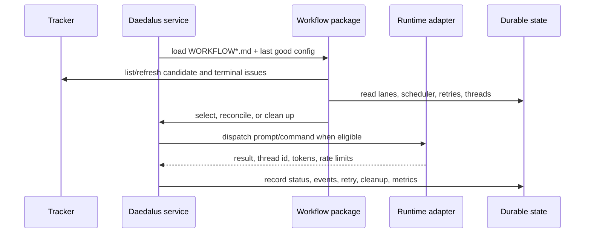
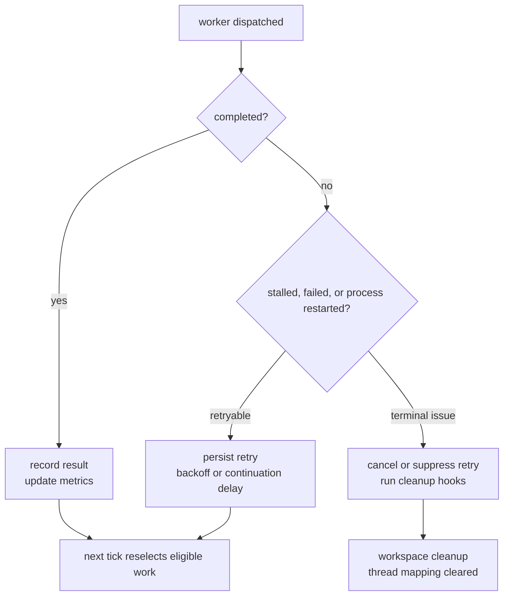

# Daedalus

**GitHub-first SDLC automation engine for Hermes Agent.**

Daedalus is a stateful workflow runtime for agent-driven software delivery. It
turns tracker issues into supervised agent work, records durable state, retries
and reconciles failures, and exposes operator surfaces for running the loop
without treating prompts or Markdown files as the scheduler.

`WORKFLOW.md` is the repo-owned contract. The engine is the plugin, database,
state files, leases, service loop, workflow packages, runtime adapters, tracker
clients, and observability around that contract.

## What Runs



The important separation:

- **Plugin code** lives under `~/.hermes/plugins/daedalus`.
- **Workflow instance data** lives under `~/.hermes/workflows/<owner>-<repo>-<workflow-type>`.
- **Repo policy** lives in `WORKFLOW.md` or `WORKFLOW-<workflow>.md`.
- **Agent work** happens in the configured repo/workspace paths, not inside the public `daedalus/projects/` tree.

## Bundled Workflows

Daedalus does not assume one universal lifecycle. The engine is shared; each
workflow package owns its own policy, schema, prompts, gates, and commands.

| Workflow | Purpose | Best fit |
|---|---|---|
| `change-delivery` | GitHub issue -> code -> internal review -> PR -> external review -> merge | Opinionated SDLC automation with review and merge gates |
| `issue-runner` | tracker issue -> isolated workspace -> hooks -> prompt -> one agent run | Generic Symphony-shaped issue execution |

`change-delivery` is the default public bootstrap path. `issue-runner` is the
cleaner reference workflow for generic tracker-driven automation and future
Symphony compatibility.

## Control Loop



Daedalus is intentionally stateful. These paths are relative to the workflow
root unless noted otherwise:

| State surface | Used for |
|---|---|
| `runtime/state/daedalus/daedalus.db` | `change-delivery` runtime rows, leases, lanes, actions, reviews, failures |
| `memory/workflow-scheduler.json` | running workers, retry queue, Codex thread mappings, token/rate-limit totals |
| `memory/workflow-audit.jsonl` | append-only workflow audit events |
| `memory/workflow-status.json` / `workflow-health.json` | operator and HTTP status projections |
| `.lane-state.json` / `.lane-memo.md` | lane-local handoff artifacts for `change-delivery` |

## Supported Public Path

- **Platform:** Linux
- **Plugin install:** `hermes plugins install attmous/daedalus --enable`
- **Plugin source of truth:** `~/.hermes/plugins/daedalus`
- **Workflow root:** `~/.hermes/workflows/<owner>-<repo>-<workflow-type>`
- **Workflow contract:** repo-owned `WORKFLOW.md` or `WORKFLOW-<workflow>.md`
- **First-class tracker:** GitHub issues through authenticated `gh`
- **Experimental tracker:** Linear
- **Supervision:** `systemd --user`
- **Runtime adapters:** `codex-app-server`, `acpx-codex`, `claude-cli`, `hermes-agent`

The current release posture is **public beta candidate**. See
[docs/release-readiness.md](docs/release-readiness.md) and
[docs/public-contract.md](docs/public-contract.md) for the supported boundary.

## Install And Start

```bash
sudo apt install python3-yaml python3-jsonschema
hermes plugins install attmous/daedalus --enable

cd /path/to/your/repo
hermes daedalus bootstrap
$EDITOR WORKFLOW.md
hermes daedalus service-up
hermes
```

Use the generic workflow instead:

```bash
hermes daedalus bootstrap --workflow issue-runner
```

`bootstrap` detects the repo, derives the GitHub slug, creates the workflow
root, writes the repo-owned workflow contract, commits it on a bootstrap branch,
and writes `./.hermes/daedalus/workflow-root` so later commands can resolve the
instance from the repo checkout.

`service-up` validates the contract, runs workflow preflight, installs the
systemd user unit, enables it, and starts the supervised loop.

If your workflow uses an external Codex app-server, start the shared listener:

```bash
hermes daedalus codex-app-server up
hermes daedalus codex-app-server doctor
```

For manual scaffold paths, service modes, pip installs, lower-level command
details, and troubleshooting, read
[docs/operator/installation.md](docs/operator/installation.md).

## Operator Surface

```text
/daedalus status
/daedalus doctor
/daedalus watch
/daedalus service-status
/workflow change-delivery status
/workflow change-delivery tick
/workflow issue-runner status
/workflow issue-runner run --max-iterations 1 --json
```

The operator surfaces read state; they do not require you to inspect SQLite,
JSONL, scheduler files, or systemd logs by hand. The optional HTTP status server
exposes workflow-scoped JSON and HTML snapshots for dashboards.

## Recovery Model



The engine keeps running on bad config reloads, tracker errors, worker failures,
and restarts. The exact behavior depends on the workflow:

- `issue-runner` has bounded async workers, retry queue persistence, terminal
  workspace cleanup, lifecycle hooks, and Codex `issue_id -> thread_id` resume.
- `change-delivery` adds active-lane state, leases, action idempotency, review
  gates, PR publishing, merge promotion, and SQLite-backed runtime state.

## Documentation

- [docs/architecture.md](docs/architecture.md) — durable runtime model and engine/workflow boundary.
- [docs/workflows/README.md](docs/workflows/README.md) — how `change-delivery` and `issue-runner` differ.
- [docs/operator/installation.md](docs/operator/installation.md) — install, bootstrap, service, and troubleshooting.
- [docs/operator/cheat-sheet.md](docs/operator/cheat-sheet.md) — day-2 commands.
- [docs/symphony-conformance.md](docs/symphony-conformance.md) — Symphony alignment and remaining gaps.
- [docs/harness-engineering.md](docs/harness-engineering.md) — public-readiness checks and guardrails.
- [docs/security.md](docs/security.md) — trust model, shell/runtime posture, and secrets.

## Name

In the myth, Daedalus built the labyrinth, gave Theseus the thread, and warned
Icarus about unsafe flight. The name is a reminder of the same engineering
shape here: build the maze, keep the recovery thread, and put limits around
autonomy.

## License

MIT — see [LICENSE](LICENSE).
