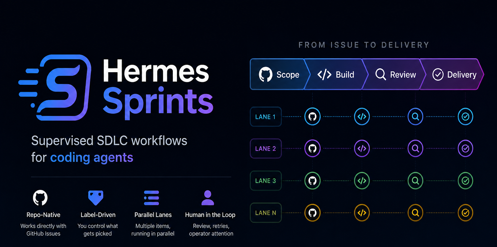

# Sprints

<p align="center">
  
</p>

Sprints is a Hermes-Agent plugin for durable supervised workflow execution.

Sprints writes a repo-owned `WORKFLOW.md`, dispatches actors through configured
runtimes, stores state, and exposes operator commands. Policy belongs in
`WORKFLOW.md`; Python owns mechanics.

## Maintainer Note

Sprints started at the beginning of April 2026 as my attempt to learn, in public
and through working code, what harness engineering and agent orchestration
really mean.

My background is in Agile software delivery, where teams move work through
issues, implementation, review, feedback, and completion. With Sprints, I am
trying to recreate that delivery loop around AI agents and humans in the loop.

On April 27, 2026, OpenAI published
[**Symphony**](https://openai.com/index/open-source-codex-orchestration-symphony/),
an open-source spec for Codex orchestration. That playbook helped me cut through
parts of my own implementation, reduce code size, and close many design gaps.

My goal is to keep improving Sprints until it becomes genuinely useful to the
[Hermes-Agent](https://hermes-agent.nousresearch.com/) community.

## Quick Start

Prerequisites:

- Hermes-Agent installed
- Git and tracker credentials available to the runtime
- Linux with `systemd --user` for `hermes sprints daemon up`

```bash
sudo apt install python3-yaml python3-jsonschema
hermes plugins install attmous/sprints --enable

cd /path/to/repo
hermes sprints bootstrap
$EDITOR WORKFLOW.md
hermes sprints codex-app-server up
hermes sprints validate
hermes sprints doctor
hermes sprints daemon up
hermes
```

Inside Hermes:

```text
/sprints status
/sprints doctor
/sprints watch
/sprints daemon status
/workflow change-delivery status
/workflow change-delivery validate
/workflow change-delivery tick
```

To run the first lane, add the `active` label to one eligible issue. The daemon
will pick it up on the next tick.

## Mental Model

Sprints is a multi-lane workflow orchestrator.

```text
tracker issue -> lane ledger -> orchestrator tick -> actor runtime turn -> gate -> next stage
                                                              |              |
                                                              `-> retry      `-> operator_attention
```

A lane is one issue, pull request, or task with durable state. The orchestrator
observes eligible lanes and decides what should happen next. Actors work on one
lane at a time through a configured runtime.

The engine stores mechanics: SQLite state, leases, retries, runtime sessions,
events, and projections. The workflow owns policy: stages, gates, actor rules,
tracker criteria, completion cleanup, and output contracts.

## Default Workflow

The default workflow template is `change-delivery`.

```text
active issue -> deliver -> review -> merge -> done
                 |          |
                 |          `-> reviewer reviews the pull request
                 `-> implementer pulls, edits, debugs, commits, pushes, and opens the pull request
```

By default, only open issues with label `active` are eligible. Completed issues
are auto-merged, have `active` removed and `done` added, so they are not
selected again.

Default concurrency is one active lane:

```yaml
execution:
  actor-dispatch: auto

concurrency:
  max-lanes: 1
  actors:
    implementer: 1
    reviewer: 1
```

With `actor-dispatch: auto`, Sprints keeps the single-lane default inline. If
you raise `max-lanes`, actor turns are dispatched as background workers so the
daemon can keep ticking and supervise other lanes. Ticks that only see running
lanes, blocked lanes, or retries that are not due yet return without calling the
orchestrator.

Lane states are internal orchestration state, not tracker status:

| State | Meaning |
| --- | --- |
| `claimed` | The lane is reserved and must not be duplicated. |
| `running` | An actor is working on the lane. |
| `waiting` | Actor output is ready for orchestrator evaluation. |
| `retry_queued` | Retry is scheduled and not ready or not yet dispatched. |
| `operator_attention` | The operator must unblock the lane. |
| `complete` | The workflow finished successfully. |
| `released` | The claim was removed because the lane is terminal or no longer eligible. |

## Runtime And Daemon

Two services are involved:

| Service | Job |
| --- | --- |
| `codex-app-server` | Runtime listener that executes actor turns. |
| `sprints daemon` | Workflow loop that triggers ticks, reconciles lanes, and dispatches actors. |

If the daemon is not running, the workflow only advances when an operator runs a
manual tick.

## What Sprints Owns

| Area | Meaning |
| --- | --- |
| Workflow contract | `WORKFLOW.md` front matter plus orchestrator/actor policy sections. |
| Runtime dispatch | Actor turns through Codex app-server, Hermes Agent, Claude, ACPX, or command-backed runtime profiles. |
| Durable state | SQLite runs, events, leases, retries, runtime sessions, and status projections. |
| Operator surface | `/sprints`, `/workflow change-delivery`, daemon control, watch output, and runtime diagnostics. |
| Trackers | Issue discovery and issue status/label updates. |
| Code hosts | Branch and pull request mechanics. GitHub currently provides both tracker and code-host boundaries. |
| Skills | Reusable actor mechanics such as `pull`, `debug`, `commit`, and `push`. |

## Workflow Model

Each contract defines:

- orchestrator actor
- runtime profiles
- actors
- stages
- gates
- actions
- storage paths

Bundled policy templates live under `sprints/workflows/templates/`:

- `issue-runner.md`
- `change-delivery.md`
- `release.md`
- `triage.md`

They use the same Python implementation: loader, typed config, runner, actors,
actions, gates, and runtime dispatch.

## Package Layout

```text
sprints/
|-- cli/          # command surface
|-- engine/       # SQLite-backed state
|-- observe/      # read-only operator views
|-- runtimes/     # runtime adapters and turn dispatch
|-- skills/       # actor skill instructions
|-- trackers/     # GitHub and Linear trackers
`-- workflows/    # WORKFLOW.md loader and workflow runner
```

## Docs

| Doc | Purpose |
| --- | --- |
| [Installation](docs/operator/installation.md) | Install, bootstrap, validate, run. |
| [Architecture](docs/architecture.md) | Current package boundaries. |
| [Workflow Contract](docs/workflows/workflow-contract.md) | `WORKFLOW.md` structure. |
| [Workflow Daemon](docs/operator/workflow-daemon.md) | Tick loop and service control. |
| [Codex App Server](docs/operator/codex-app-server.md) | Default runtime listener. |
| [Runtimes](docs/concepts/runtimes.md) | Actor/runtime execution path. |
| [Engine](docs/concepts/engine.md) | Durable state model. |
| [Skills](sprints/skills/README.md) | Actor skill packages. |
| [Slash Commands](docs/operator/slash-commands.md) | Command reference. |
| [Security](docs/security.md) | Trust model and execution risk. |

## License

MIT. See [LICENSE](LICENSE).
