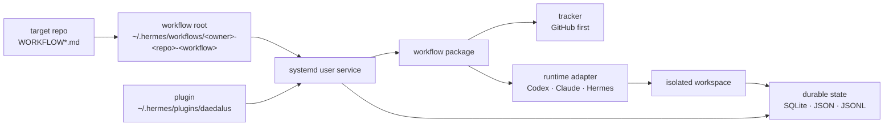

# Daedalus

**GitHub-first SDLC automation engine for Hermes Agent.**

Daedalus is a durable control plane for agentic software work. It turns tracker
issues into supervised workflow runs, dispatches agents through runtime
adapters, persists state, reconciles failures, and gives operators a live
surface for the loop.

`WORKFLOW.md` is the repo-owned workflow contract. It is not the scheduler.
The scheduler is the Daedalus plugin, service loop, workflow package, state
store, leases, tracker clients, runtime adapters, and observability around that
contract.

## Mental Model



The separation is intentional:

- Plugin code lives in `~/.hermes/plugins/daedalus`.
- Workflow instance data lives in `~/.hermes/workflows/<owner>-<repo>-<workflow-type>`.
- Repo policy and operator config live in `WORKFLOW.md` or `WORKFLOW-<workflow>.md`.
- Agent work happens in configured workspaces, not in `daedalus/projects/`.

## Bundled Workflows

| Workflow | What it automates | Use it when |
|---|---|---|
| `change-delivery` | GitHub issue -> implementation -> internal review -> PR -> external review -> merge | You want the opinionated SDLC workflow with review and merge gates. |
| `issue-runner` | tracker issue -> workspace -> hooks -> prompt -> one agent run | You want a smaller generic tracker-driven workflow. |

`change-delivery` is the default bootstrap path. `issue-runner` is the cleaner
generic reference workflow and the closest surface to Symphony-style issue
execution.

## What Is Stateful

Daedalus is not controlled by Markdown files alone. The workflow contract is
configuration; runtime truth is persisted separately.

| Surface | Purpose |
|---|---|
| `runtime/state/daedalus/daedalus.db` | `change-delivery` leases, lanes, actions, reviews, failures |
| `memory/workflow-scheduler.json` | running workers, retries, Codex thread mappings, token/rate-limit totals |
| `memory/workflow-audit.jsonl` | workflow audit history |
| `memory/workflow-status.json` / `workflow-health.json` | operator and HTTP status projections |

## Quick Start

```bash
sudo apt install python3-yaml python3-jsonschema
hermes plugins install attmous/daedalus --enable

cd /path/to/your/repo
hermes daedalus bootstrap
$EDITOR WORKFLOW.md
hermes daedalus service-up
hermes
```

Bootstrap creates the workflow root, writes the repo-owned contract, commits it
on a bootstrap branch, and stores a repo-local pointer so later commands can
resolve the workflow instance.

Use the generic workflow instead:

```bash
hermes daedalus bootstrap --workflow issue-runner
```

For manual scaffold paths, service modes, pip installs, and every lower-level command,
use the full install guide:
[docs/operator/installation.md](docs/operator/installation.md).

## Configure The Workflow

Edit the generated repo contract:

- `WORKFLOW.md` when the repo carries one workflow
- `WORKFLOW-change-delivery.md` / `WORKFLOW-issue-runner.md` when it carries more than one

Common knobs live in the YAML front matter:

- `repository` / `tracker`: repo checkout, GitHub slug, labels, issue states
- `runtimes`: `codex-app-server`, `acpx-codex`, `claude-cli`, `hermes-agent`
- `agents`: model/runtime bindings for workflow roles
- `gates` / `hooks`: workflow-specific policy
- `observability` / `server`: comments, webhooks, HTTP status

The Markdown body is the workflow policy prompt. The workflow package decides
how to use it.

## Operate It

```text
/daedalus status
/daedalus doctor
/daedalus watch
/daedalus service-status
/workflow change-delivery status
/workflow change-delivery tick
/workflow issue-runner status
/workflow issue-runner run --max-iterations 1 --json
```

The operator surfaces read the persisted state for you. You should not need to
inspect SQLite, scheduler JSON, JSONL logs, or systemd journals by hand during
normal operation.

## Public Posture

- **First-class tracker:** GitHub issues through authenticated `gh`
- **Experimental tracker:** Linear
- **Supervision:** `systemd --user`
- **Runtime adapters:** `codex-app-server`, `acpx-codex`, `claude-cli`, `hermes-agent`
- **Release posture:** public beta candidate

Stable public boundaries are tracked in [docs/public-contract.md](docs/public-contract.md).
Readiness and generic-surface guardrails are tracked in
[docs/harness-engineering.md](docs/harness-engineering.md).

## Documentation

- [docs/operator/installation.md](docs/operator/installation.md) — full install, bootstrap, service, and troubleshooting path.
- [docs/workflows/README.md](docs/workflows/README.md) — workflow comparison and templates.
- [docs/architecture.md](docs/architecture.md) — engine/workflow boundary and durable runtime model.
- [docs/operator/cheat-sheet.md](docs/operator/cheat-sheet.md) — day-2 commands and debugging.
- [docs/symphony-conformance.md](docs/symphony-conformance.md) — Symphony alignment and remaining gaps.
- [docs/security.md](docs/security.md) — trust model, shell/runtime posture, and secrets.

## Name

Daedalus built the labyrinth, kept the thread, and understood the risk of
unchecked flight. The project uses the name as a reminder: build the workflow
maze, keep recovery paths visible, and put limits around autonomy.

## License

MIT — see [LICENSE](LICENSE).
