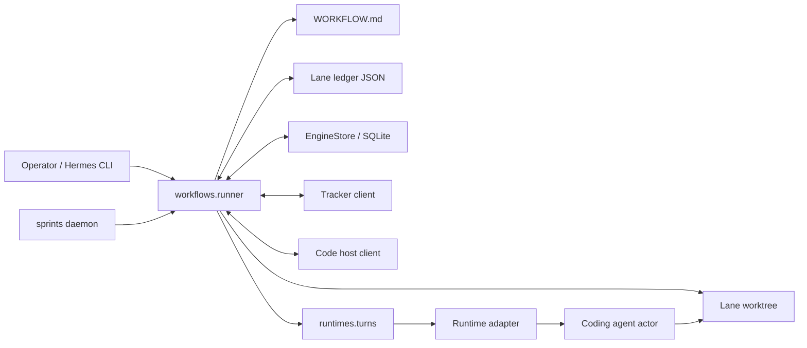
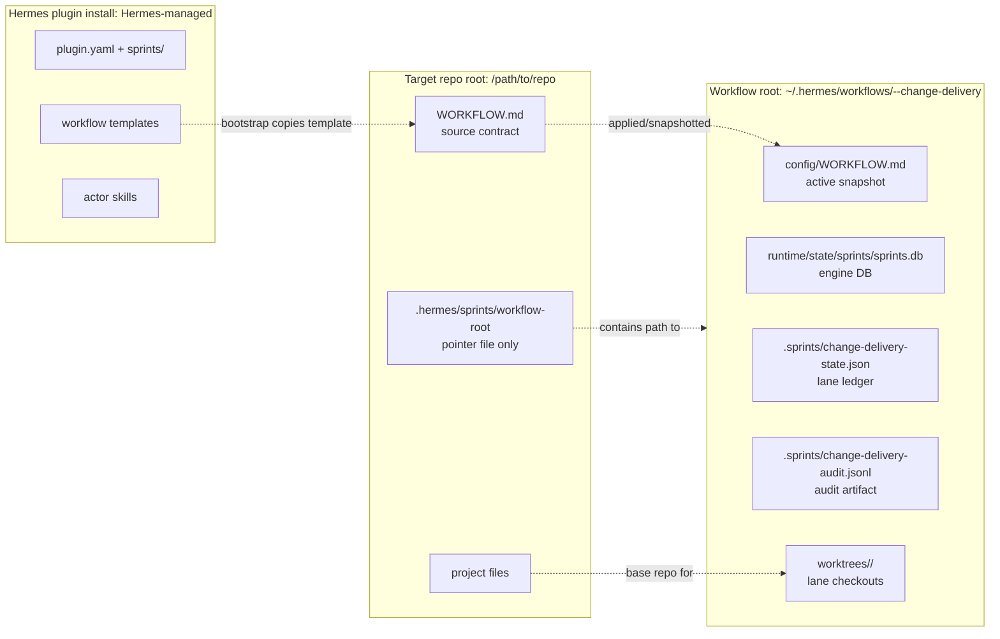
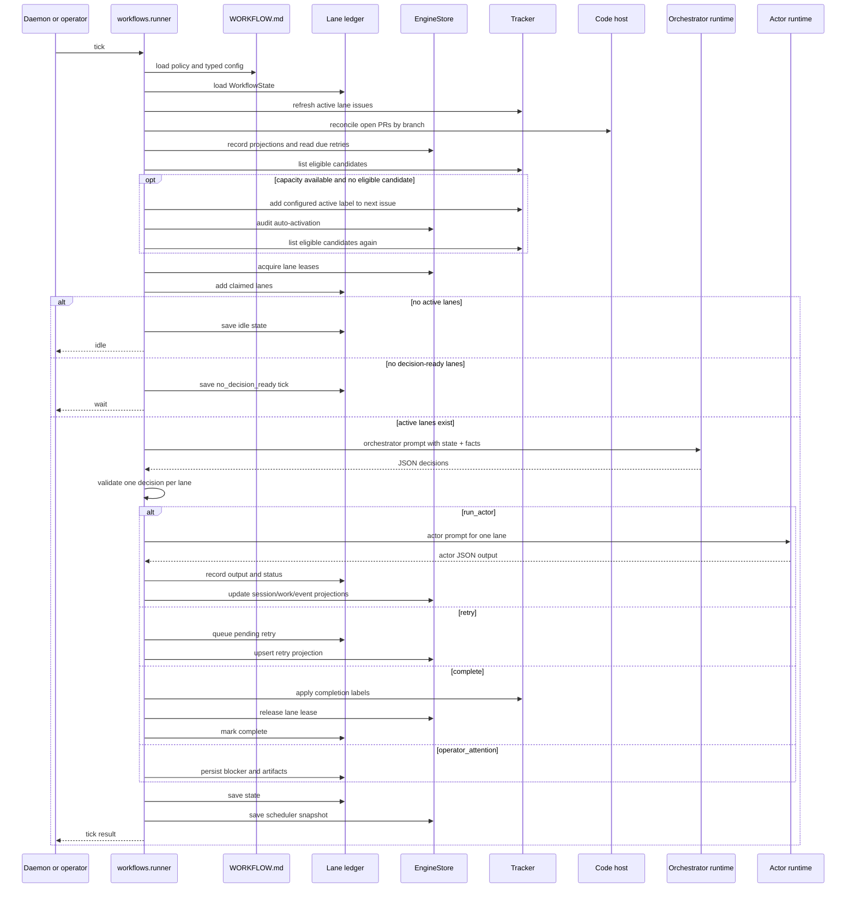
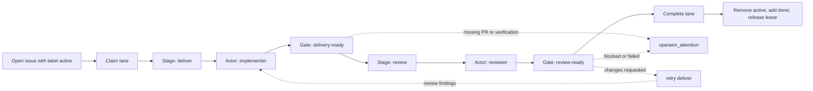
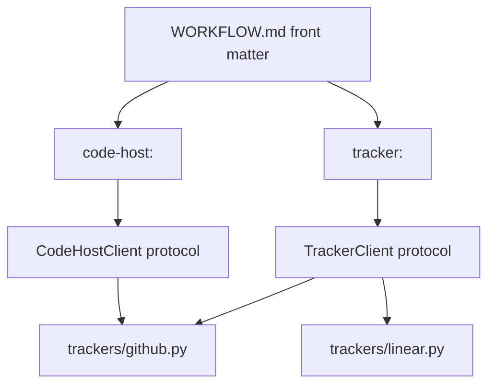
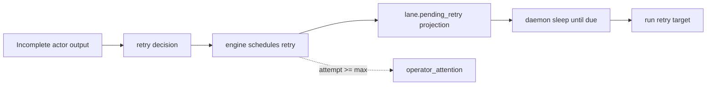
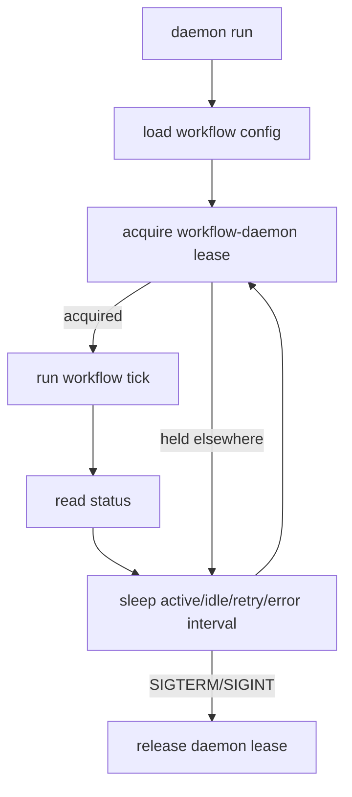

# Architecture

Sprints is a Hermes-Agent plugin for repo-owned supervised workflow execution.

The core boundary is strict:

```text
WORKFLOW.md decides policy.
Sprints executes mechanics.
```

Policy means eligibility, stages, gates, actor instructions, output contracts,
retry limits, completion cleanup, and runtime bindings. Mechanics means loading
contracts, claiming lanes, dispatching actor turns, persisting state, reconciling
trackers and pull requests, and exposing operator commands.

## Table Of Contents

- [Vocabulary](#vocabulary)
- [System Map](#system-map)
- [Filesystem Topology](#filesystem-topology)
- [Package Boundaries](#package-boundaries)
- [Workflow Contract](#workflow-contract)
- [Tick Lifecycle](#tick-lifecycle)
- [Lane Ledger](#lane-ledger)
- [Lane State Machine](#lane-state-machine)
- [Default Change Delivery Flow](#default-change-delivery-flow)
- [Orchestrator Decisions](#orchestrator-decisions)
- [Actor Runtime Path](#actor-runtime-path)
- [Skills](#skills)
- [Worktrees](#worktrees)
- [Tracker And Code Host](#tracker-and-code-host)
- [Engine Design](#engine-design)
- [Reconciliation](#reconciliation)
- [Retry Model](#retry-model)
- [Failure And Recovery](#failure-and-recovery)
- [Daemon Design](#daemon-design)
- [Invariants](#invariants)
- [File Map](#file-map)
- [Design Pressure Points](#design-pressure-points)

## Vocabulary

| Term | Meaning |
| --- | --- |
| Workflow contract | Repo-owned `WORKFLOW.md`: YAML front matter plus Markdown policy sections. |
| Workflow root | Sprints runtime directory for one configured workflow. Holds state, contract snapshot, runtime files, and lane worktrees. |
| Lane | One issue, pull request, or task with durable orchestration state. |
| Tick | One orchestrator cycle: reconcile, claim, ask orchestrator, apply decisions, persist. |
| Turn | One prompt/result exchange with a configured runtime adapter. |
| Orchestrator | The authoritative actor that decides lane transitions. |
| Actor | A runtime-backed agent that works on one lane. |
| Gate | A policy checkpoint evaluated by the orchestrator and enforced by runner contracts. |
| Skill | Actor-side instruction package for reusable mechanics such as pull, debug, commit, and push. |
| Tracker | External issue source and label/status mutator. |
| Code host | Branch and pull request boundary. GitHub currently implements both tracker and code-host behavior. |
| Engine | SQLite-backed durable mechanics: leases, events, runs, retries, sessions, projections. |

## System Map



The operator and daemon both enter through the same workflow CLI path. The
daemon only repeats ticks; it does not execute actor logic. Actor logic always
crosses the runtime boundary.

## Filesystem Topology

Sprints uses three different filesystem roots. Keeping them separate avoids most
operator confusion.



### Target Repo Root

This is the repository Sprints operates on. It contains the code being changed
and the repo-owned workflow contract. The workflow root is not inside this tree
by default.

```text
/path/to/repo/
|-- WORKFLOW.md
`-- <project files>
```

`WORKFLOW.md` is the operator-editable contract.

Bootstrap also writes a local pointer file:

```text
/path/to/repo/.hermes/sprints/workflow-root
```

That file contains the path to the active workflow root. It is not the workflow
root, and it does not hold lane state, engine state, or worktrees.

### Hermes Plugin Install

Hermes installs and loads Sprints as a plugin package. The exact install/cache
directory is owned by Hermes, but the shape is the same package shape from this
repo.

```text
<hermes plugin install>/
|-- plugin.yaml
`-- sprints/
    |-- cli/
    |-- workflows/
    |   `-- templates/
    |-- engine/
    |-- runtimes/
    |-- trackers/
    `-- skills/
```

Bundled templates and skills live with the plugin. They are defaults and
runtime instructions, not per-repo mutable state.

### Workflow Root

Bootstrap creates one workflow root per target repo and workflow.

Default shape:

```text
~/.hermes/workflows/<owner>-<repo>-change-delivery/
|-- config/
|   |-- WORKFLOW.md
|   |-- workflow-contract-path
|   |-- workflow-contract.json
|   `-- contracts/
|-- runtime/
|   `-- state/
|       `-- sprints/
|           `-- sprints.db
|-- .sprints/
|   |-- change-delivery-state.json
|   `-- change-delivery-audit.jsonl
`-- worktrees/
    `-- <lane-id>/
```

The workflow root is operational state. It holds the active contract snapshot,
engine database, lane ledger, audit artifacts, and lane worktrees.

| Path | Owner | Purpose |
| --- | --- | --- |
| `WORKFLOW.md` in repo root | Operator | Source workflow contract. |
| `.hermes/sprints/workflow-root` in repo root | Bootstrap/CLI | Pointer from repo to workflow root. |
| `config/WORKFLOW.md` in workflow root | Sprints | Active contract snapshot used by the runner. |
| `runtime/state/sprints/sprints.db` | Engine | Durable SQLite mechanics. |
| `.sprints/*-state.json` | Workflow runner | Rich lane ledger and orchestrator context. |
| `.sprints/*-audit.jsonl` | Workflow runner | Workflow audit artifact. |
| `worktrees/<lane-id>/` | Workflow runner and actors | Isolated lane checkout and branch. |

## Package Boundaries

| Package | Owns | Does Not Own |
| --- | --- | --- |
| `cli/` | Hermes command parsing and output rendering. | Workflow policy or state transitions. |
| `workflows/` | Contract loading, typed config, lane reconciliation, runner ticks, daemon loop, prompt rendering, decision application. | Runtime protocol details, tracker implementations, SQL schema. |
| `engine/` | SQLite schema, `EngineStore`, leases, events, runs, retries, runtime session projections, work item projections, reports. | Workflow stages, gates, actor policy, tracker labels. |
| `runtimes/` | Runtime adapter protocol and backend-specific turn execution. | Lane transitions or orchestrator decisions. |
| `trackers/` | Tracker and code-host client protocols plus GitHub/Linear implementations. | Lane state ownership. |
| `skills/` | Actor skill documentation injected into actor prompts. | Runner state mutation. |
| `observe/` | Read-only operator views over status and state. | Mutations. |

## Workflow Contract

`WORKFLOW.md` is split into two parts:

1. YAML front matter: machine-readable config.
2. Markdown sections: human-readable policy consumed by agents.

```text
---
workflow: change-delivery
tracker: ...
intake: ...
code-host: ...
execution: ...
concurrency: ...
retry: ...
completion: ...
runtimes: ...
actors: ...
stages: ...
gates: ...
storage: ...
---

# Orchestrator Policy

# Actor: implementer

# Actor: reviewer
```

The loader path is:

```text
workflows.contracts -> workflows.config -> workflows.registry -> workflows.runner
```

`contracts.py` loads front matter and policy sections. `config.py` turns front
matter into typed dataclasses and validates references. `registry.py` selects
the workflow implementation. Today, bundled templates share the same normalized
runner implementation.

## Tick Lifecycle

One tick is the central unit of orchestration.



Runner entry points live in `sprints/workflows/runner.py`:

- `main()` defines workflow subcommands.
- `_tick()` runs the full cycle.
- `_run_orchestrator()` builds the orchestrator prompt.
- `_apply_decisions()` plans and applies decisions.
- `run_stage_actor()` renders actor prompts and dispatches runtimes.

Backlog promotion is runner-owned. If `intake.auto-activate.enabled` is true,
capacity is available, and no issue currently satisfies tracker eligibility,
the runner adds the configured active label to the next open issue that does
not have excluded labels. That mutation is audited in the engine event stream
before the issue is claimed as a lane.

## Lane Ledger

The lane ledger is the rich workflow state owned by `workflows/lanes.py` and
stored through `WorkflowState` in the workflow storage path.

New lanes are shaped like this:

```json
{
  "lane_id": "github#20",
  "issue": {},
  "stage": "deliver",
  "status": "claimed",
  "actor": null,
  "thread_id": null,
  "turn_id": null,
  "runtime_session": {},
  "branch": "codex/issue-20-short-title",
  "pull_request": null,
  "attempt": 1,
  "last_progress_at": "2026-05-03T00:00:00Z",
  "last_actor_output": null,
  "actor_outputs": {},
  "action_results": {},
  "stage_outputs": {},
  "pending_retry": null,
  "retry_history": [],
  "operator_attention": null,
  "claim": {
    "state": "Claimed",
    "lease": {}
  }
}
```

The ledger keeps policy context that the orchestrator needs: issue payload,
stage, actor outputs, PR metadata, branch, retry history, runtime session IDs,
and operator attention artifacts.

The engine records durable projections of that lane so operators and recovery
tools can inspect state without parsing policy-shaped JSON.

## Lane State Machine

```mermaid
stateDiagram-v2
    [*] --> claimed: eligible issue + lease acquired
    claimed --> running: run_actor
    running --> waiting: actor returned valid output
    running --> operator_attention: runtime failed or invalid output
    waiting --> running: next run_actor
    waiting --> retry_queued: retry decision
    retry_queued --> running: retry due + run_actor
    retry_queued --> operator_attention: retry limit exceeded
    waiting --> complete: terminal gate passes
    waiting --> operator_attention: gate/output contract fails
    claimed --> released: tracker no longer eligible
    waiting --> released: operator release or no longer eligible
    complete --> [*]: terminal; lease released
    released --> [*]: terminal
    operator_attention --> retry_queued: operator retry
```



There are two related state vocabularies:

| State Type | Values | Owner |
| --- | --- | --- |
| Lane status | `claimed`, `running`, `waiting`, `retry_queued`, `operator_attention`, `complete`, `released` | Workflow runner |
| Claim state | `Claimed`, `Running`, `RetryQueued`, `Released` | Engine lease projection |

Tracker state is separate. A GitHub issue can still be open while the Sprints
lane is `running`, `retry_queued`, or `operator_attention`.

## Default Change Delivery Flow

Bootstrap writes `change-delivery` by default.



The implementer owns the full delivery loop:

```text
pull -> edit -> debug -> commit -> push -> create/update pull request -> JSON output
```

The runner only advances from `deliver` to `review` when the implementer output
has:

- `status: done`
- `pull_request.url`
- non-empty `verification`

The runner only completes review when the reviewer output has:

- `status: approved`
- an existing pull request URL on the lane

When the reviewer returns `changes_requested` or `needs_changes`, the
orchestrator must retry `deliver` with the reviewer findings as feedback. The
runner rejects any other transition while those fixes are pending. Before the
implementer gets the retry handoff, the runner can post the findings as a
formal pull request change request and to the source issue. Notification records
are fingerprinted so repeated ticks do not repost the same review side effect.

On successful completion, the bundled change-delivery template runs runner-owned
auto-merge first, then configured cleanup removes `active`, adds `done`, and
releases the lane lease. If merge, checks, permissions, or cleanup block
completion, the lane moves to `operator_attention`. GitHub auto-merge readiness
checks PR state, draft status, mergeability, merge state, review decision,
status checks, and unresolved review threads before calling `gh pr merge`.

## Orchestrator Decisions

The orchestrator receives:

- typed workflow config
- full workflow state
- lane ledger
- decision-ready lane summaries
- tracker candidates and terminal issues
- engine work item projections
- runtime session projections
- due retries
- concurrency and recovery config

It returns JSON. The parser supports:

| Decision | Meaning |
| --- | --- |
| `run_actor` | Dispatch one actor for one lane and stage. |
| `retry` | Queue durable retry state with feedback and due time. |
| `complete` | Complete a lane, run cleanup, and release ownership. |
| `operator_attention` | Stop automation for that lane and persist the blocker. |
| `advance` | Move to another stage. Supported mechanically, used carefully. |
| `run_action` | Run deterministic action. Supported mechanically, not the default delivery style. |

Planning rules enforced by the runner:

- one decision per lane per tick
- no orchestrator turn when all active lanes are running, blocked for operator
  attention, or waiting for retry time
- no dispatch for terminal lanes
- no duplicate dispatch for `running` lanes
- no dispatch when an active runtime session or actor run already exists for the lane
- retry lanes can only dispatch their due retry target
- actor concurrency is checked against existing running work and the planned
  decision batch before dispatch
- lane stage must match the decision unless it is a valid next-stage handoff

## Actor Runtime Path

Actors do not run in `workflows/`. They cross the runtime boundary.

```text
runner.run_stage_actor
  -> guard lane/runtime/run dispatch
  -> engine.start_run(mode=actor)
  -> engine.upsert_runtime_session
  -> workflows.actors.actor_runtime_plan
  -> workflows.actors.append_actor_skill_docs
  -> runtimes.build_runtimes
  -> runtimes.turns.run_runtime_stage
  -> selected runtime adapter
  -> engine.finish_run
```

`execution.actor-dispatch` defines whether this path blocks the tick:

| Mode | Behavior |
| --- | --- |
| `auto` | Inline at `max-lanes: 1`; background workers when lane concurrency is raised. |
| `inline` | The tick owns the full actor turn and saves the final lane state before returning. |
| `background` | The tick records the lane as `running`, starts an `actor-run` subprocess, saves state, and returns. The worker later reacquires the workflow state lock to merge output. |

`runtimes/turns.py` normalizes one Sprints turn. A backend may internally have
its own protocol turns, sessions, or event stream, but workflow code sees one
prompt/result exchange plus metadata.

Every actor dispatch gets a durable `engine_runs` row with `mode=actor`.
Runtime session rows, lane runtime metadata, and runtime events all carry the
same `run_id`. Background actor workers also write a small heartbeat artifact
beside the dispatch file. Reconciliation treats that heartbeat as the latest
runtime timestamp, so a healthy long-running worker does not look stale just
because lane JSON is waiting for the final output.

When a running lane and its heartbeat are stale, reconciliation marks that
runtime session and actor run `interrupted`. With `auto-retry-interrupted`
enabled, it then queues a durable retry to the same stage and actor with the
recorded runtime session as recovery context. If recovery cannot be targeted
safely, the lane moves to operator attention.

Runtime session status is normalized to:

| Status | Meaning |
| --- | --- |
| `running` | Actor turn is active. |
| `completed` | Actor returned a valid successful handoff. |
| `blocked` | Actor returned blockers or the output contract forced operator attention. |
| `failed` | Runtime failed or actor output was structurally invalid. |
| `interrupted` | A stale running turn was recovered by reconciliation. |

Runtime examples:

| Runtime kind | Execution style |
| --- | --- |
| `codex-app-server` | Talks to the Codex App server. Requires `hermes sprints codex-app-server up`. |
| `hermes-agent` | Runs Hermes-Agent CLI directly. In final mode it uses `hermes -z <prompt>`. |
| `claude-cli` | Runs Claude CLI adapter. |
| `acpx-codex` | Runs Codex through ACPX adapter. |
| command-backed profile | Writes prompt/result files and runs configured argv. |

The workflow daemon is runtime-independent. It only triggers ticks. The
`codex-app-server` service is only required for actors bound to the
`codex-app-server` runtime profile.

## Skills

Skills are prompt-time actor mechanics. `workflows.actors.append_actor_skill_docs`
reads `sprints/skills/<name>/SKILL.md` and appends the selected docs to the
actor prompt.

The default implementer uses:

- `pull`
- `debug`
- `commit`
- `push`

This keeps detailed operational mechanics out of the Python runner while still
making them available to the coding agent.

Skills should return useful artifacts through actor JSON output. They should not
mutate unrelated lane state or wait for interactive approval.

## Worktrees

Each lane runs in its own Git worktree.

```text
repository.local-path
      |
      v
git worktree add <workflow-root>/worktrees/<lane-id> <branch>
```

`workflows/worktrees.py` owns:

- repository path validation
- base ref selection, default `origin/main`
- lane worktree path derivation
- lane branch naming
- `git fetch`
- `git worktree add`

The runner records `branch`, `worktree`, and `base_ref` on the lane before
dispatching the actor.

## Tracker And Code Host

Trackers and code hosts are separate contracts even when one provider implements
both.



Tracker responsibilities:

- list all issues
- list eligible candidates
- refresh active lane issues
- list terminal issues
- add/remove labels
- normalize issue shape

Code-host responsibilities:

- list open pull requests
- create pull requests
- comment on pull requests and issues
- mark pull requests ready
- merge pull requests
- inspect review threads and reactions

GitHub currently owns both boundaries in `trackers/github.py`. Linear currently
owns tracker behavior only.

## Engine Design

The engine is a workflow-scoped SQLite API, not the workflow brain.

```text
workflows/* -> EngineStore -> engine.state/db/leases -> SQLite
```

Default DB path:

```text
<workflow-root>/runtime/state/sprints/sprints.db
```

Engine tables:

| Table | Purpose |
| --- | --- |
| `engine_work_items` | Tracker-neutral projection of lane lifecycle. |
| `engine_running_work` | Running work projection for scheduler/operator views. |
| `engine_retry_queue` | Durable retry projection and due-time lookup. |
| `engine_runtime_sessions` | Runtime session/thread/turn metadata by work item. |
| `engine_runtime_totals` | Token and turn totals. |
| `engine_runs` | Durable daemon, tick, and actor run records. |
| `engine_events` | Event timeline by workflow, run, and work item. |
| `leases` | SQLite-backed mutual exclusion for daemon and lane claims. |

The current state split is intentional but transitional:

| State | Current Owner |
| --- | --- |
| Rich lane JSON | `workflows/lanes.py` and workflow storage file |
| Durable projections | `engine/` SQLite tables |
| Policy context | `WORKFLOW.md` and lane JSON |
| Operator inspection | engine reports plus workflow status |

Later engine waves can move more ownership into `engine/`, especially retry
wakeups and transactional lane lifecycle transitions. Retry attempt limits,
backoff, due-time planning, and retry queue persistence are engine-owned.
Workflow policy should still stay outside the engine.

## Reconciliation

Before each dispatch, the runner reconciles three external realities:

| Reconcile Path | What It Checks | Result |
| --- | --- | --- |
| Runtime reconciliation | Running lanes whose runtime session or background heartbeat has not progressed within `recovery.running-stale-seconds`. | Marks the runtime session and actor run `interrupted`, then queues a recovery retry to the same actor/stage or moves the lane to `operator_attention` if recovery is unsafe. |
| Tracker reconciliation | Active lane issue still exists and remains eligible. | Updates issue payload or releases lane. |
| Pull request reconciliation | Open PRs matching lane branch. | Updates `lane.pull_request`. |

This is what makes interrupted or externally changed work recoverable. The next
tick sees the real world again before asking the orchestrator what to do.

## Retry Model

Retries are durable lane state, not immediate recursion.



`queue_lane_retry()` asks `EngineStore.schedule_retry()` to compute and persist:

- next attempt
- retry limit exhaustion
- backoff delay
- due time
- `engine_retry_queue` row

The lane keeps a workflow-facing retry projection for actor handoff:

- target stage
- target actor/action
- reason and feedback inputs
- queued time
- retry history

That projection is not a second scheduler. Scheduler snapshots intentionally do
not rebuild `engine_retry_queue`; retry rows are only created through
`EngineStore.schedule_retry()` and cleared through `EngineStore.clear_retry()`.

The daemon shortens sleep when a retry is due soon. The runner validates that
retry dispatch uses the queued target and only runs after the due time. When a
queued retry is dispatched, the runner consumes the retry projection and clears
the engine queue row before marking the lane running.

## Failure And Recovery

| Failure | Handling |
| --- | --- |
| Actor returns invalid JSON | Lane becomes `operator_attention`; runtime/session artifacts are preserved. |
| Actor returns unsupported status | Lane becomes `operator_attention` with output contract artifacts. |
| Implementer omits PR or verification | Delivery contract fails; lane becomes `operator_attention`. |
| Reviewer requests changes without concrete fixes | Lane becomes `operator_attention`. |
| Runtime command fails | Lane becomes `operator_attention`; runtime result metadata is recorded when available. |
| Duplicate dispatch guard trips | Lane becomes `operator_attention`; active session/run conflicts are recorded. |
| Running lane goes stale | Reconciliation marks the actor run `interrupted` and queues a same actor/stage recovery retry; unsafe recovery moves to `operator_attention`. |
| Retry limit exceeded | Lane becomes `operator_attention`. |
| Tracker cleanup fails | Completion is stopped and artifacts are recorded. |
| Issue loses eligibility | Lane is released. |

Operator commands can retry, release, or complete lanes. The runner refuses
unsafe mutations such as releasing a running lane.

## Daemon Design

The daemon is a thin tick scheduler.



Default timing:

| Condition | Sleep |
| --- | --- |
| Active lanes | 15 seconds |
| Idle workflow | 60 seconds |
| Due retry cap | 30 seconds |
| Error | 60 seconds |
| Lease TTL | 90 seconds |

The daemon uses a workflow-scoped lease so duplicate services do not tick the
same workflow concurrently.

## Invariants

These rules protect the mental model:

- `WORKFLOW.md` is policy; Python is mechanics.
- One lane maps to one active issue/PR/task.
- One actor turn works on exactly one lane.
- One tick may return many decisions, but at most one decision per lane.
- The orchestrator only runs when at least one lane is decision-ready:
  `claimed`, `waiting`, or `retry_queued` with a due retry.
- No duplicate work is dispatched for a running lane.
- No duplicate actor turn is dispatched while an active runtime session or actor
  run already exists for the lane.
- Actor limits are workflow-global. Existing running lane status, runtime
  sessions, engine actor runs, and current tick reservations all consume
  actor capacity inside the lane limit.
- Tracker state is eligibility, not orchestration ownership.
- Engine leases protect ownership; lane JSON keeps rich context.
- Runtime adapters return normalized results; workflows do not know backend
  protocols.
- Skills give actors mechanics; skills do not own lane state.
- Completion cleanup is mechanical and comes from workflow config.

## File Map

```text
sprints/
|-- cli/
|   |-- commands.py       # Hermes command handlers
|   |-- render.py         # output rendering helpers
|   `-- formatters.py     # human-readable formatting
|-- workflows/
|   |-- contracts.py      # WORKFLOW.md load/render/policy parsing
|   |-- loader.py         # loader facade
|   |-- config.py         # typed front matter config
|   |-- registry.py       # workflow object registry and CLI dispatch
|   |-- runner.py         # tick, status, lane commands, actor/action dispatch
|   |-- lanes.py          # lane ledger, reconciliation, transitions, projections
|   |-- daemon.py         # daemon loop and systemd controls
|   |-- orchestrator.py   # prompt rendering and decision parsing
|   |-- actors.py         # actor runtime planning and skill injection
|   |-- actions.py        # deterministic actions
|   |-- bindings.py       # runtime binding helpers
|   |-- validation.py     # contract validation and readiness checks
|   |-- bootstrap.py      # repo bootstrap
|   |-- worktrees.py      # lane worktree mechanics
|   |-- paths.py          # workflow/runtime paths
|   |-- schema.yaml       # config schema
|   `-- templates/        # bundled WORKFLOW.md templates
|-- engine/
|   |-- db.py             # SQLite connection and schema
|   |-- store.py          # workflow-scoped EngineStore API
|   |-- state.py          # SQL state operations
|   |-- leases.py         # SQLite-backed leases
|   |-- scheduler.py      # scheduler snapshot shape
|   |-- lifecycle.py      # pure lifecycle helpers
|   |-- reports.py        # run/event reports
|   |-- retention.py      # event retention config
|   `-- work.py           # work/result dataclasses
|-- runtimes/
|   |-- turns.py          # backend-neutral Sprints turn boundary
|   |-- codex_app_server.py
|   |-- hermes_agent_cli.py
|   |-- claude_cli.py
|   |-- codex_acpx.py
|   `-- codex_service.py
|-- trackers/
|   |-- __init__.py       # TrackerClient and CodeHostClient protocols
|   |-- github.py         # GitHub tracker and code-host
|   `-- linear.py         # Linear tracker
|-- skills/
|   |-- pull/
|   |-- debug/
|   |-- commit/
|   |-- push/
|   `-- land/
`-- observe/
    |-- sources.py
    `-- watch.py
```

## Design Pressure Points

The current model is intentionally lane-first, but a few areas are still active
design pressure:

- Engine projections exist, but rich lane state still lives in workflow JSON.
- Retry due times are projected into the engine, but workflow ticks still drive
  actual retry dispatch.
- `run_action` exists for deterministic mechanics, but the default delivery
  workflow gives PR creation to the implementer actor through skills.
- Runtime session persistence now feeds actor capacity, but the default remains
  conservative because runtime backends still execute actor turns synchronously
  from the runner's point of view.
- GitHub currently holds tracker and code-host behavior in one file; the
  boundary is logical even when implementation is colocated.
