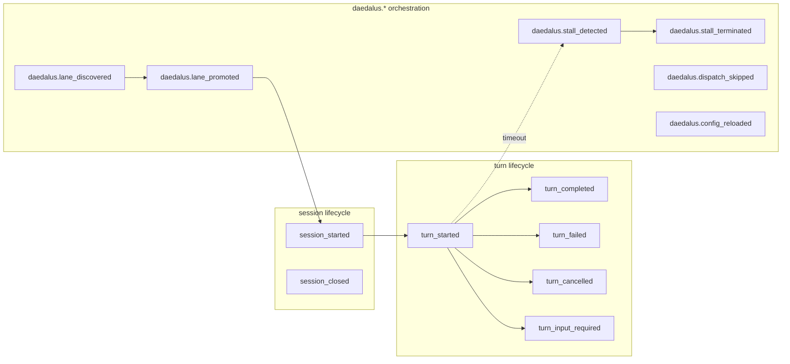

# Events

Append-only history of what the runtime and workflows did. Daedalus stores
operator-facing events in the shared SQLite `engine_events` ledger and still
writes JSONL audit tails such as `runtime/memory/daedalus-events.jsonl` and
`memory/workflow-audit.jsonl` for compatibility and file-oriented debugging.

These event streams are consumed by:

- the operator dashboard and HTTP status server
- the alerting layer
- post-hoc auditing
- regression tests that snapshot lifecycles

State is workflow-specific. **History is in events.** Never reconstruct current state by replaying events.

- Shared engine execution state is in SQLite: work items, running workers, retry queue, runtime sessions, and token totals.
- `agentic` adds workflow-specific state through generic stages, actor outputs, action results, and orchestrator decisions.
- JSON status/health/scheduler files are projections for operators and file-oriented tools.
- Engine events are queryable by run, work item, type, and severity.
- JSONL audit files are retained as write-ahead/debug tails, not the primary operator query path.

## Anatomy of an event

```json
{
  "type": "daedalus.turn_completed",
  "lane_id": "01HF3Q…",
  "issue_number": 42,
  "actor_id": "coder-claude-1",
  "at": "2026-04-28T14:03:11Z",
  "payload": { "model": "opus", "input_tokens": 1342, "output_tokens": 506 }
}
```

## Taxonomy (Symphony §10.4)

Daedalus follows the Symphony event taxonomy with a `daedalus.*` prefix on orchestration events.



## Where bare-name vs prefixed applies

| Layer | Bare name | Prefixed |
|---|---|---|
| Turn-level (model, runtime) | ✅ canonical | also accepted |
| Lane-level (Daedalus orchestration) | accepted (alias window) | ✅ canonical |
| Session-level | ✅ canonical | also accepted |

`workflows.event_taxonomy.canonicalize(event_type)` resolves event names to the current canonical name.

## Event writer

Runtime events are appended by `daedalus/runtime.py::append_daedalus_event`. The function:

1. Builds the event dict with `type`, `lane_id`, `at`, and `payload`
2. Atomically appends one JSON line to `runtime/memory/daedalus-events.jsonl`
3. Best-effort indexes the same event into SQLite `engine_events`
4. Never lets observability indexing break workflow execution

### Retention

Set durable event retention in `WORKFLOW.md`:

```yaml
retention:
  events:
    max-age-days: 30
    max-rows: 100000
```

Apply it manually or from automation:

```bash
hermes daedalus events stats --workflow-root ~/.hermes/workflows/<profile>
hermes daedalus events prune --workflow-root ~/.hermes/workflows/<profile>
```

The long-running service applies configured SQLite event retention automatically
at startup and after each supervised loop/tick. Manual `events prune` is for
one-off cleanup, emergency compaction, or testing a new retention policy before
running the service.

For JSONL tails, archive files normally if they grow too large. The next event
write creates a fresh `daedalus-events.jsonl`.

### Event schema

All events share a common envelope:

```json
{
  "type": "daedalus.turn_completed",
  "lane_id": "lane:220",
  "issue_number": 42,
  "actor_id": "coder-claude-1",
  "at": "2026-04-28T14:03:11Z",
  "payload": { ... }
}
```

| Field | Required | Notes |
|---|---|---|
| `type` | ✅ | Canonical event type. |
| `lane_id` | ❌ | Present for lane-scoped events. |
| `issue_number` | ❌ | Present for lane-scoped events. |
| `actor_id` | ❌ | Present for actor-scoped events. |
| `at` | ✅ | ISO-8601 UTC timestamp. |
| `payload` | ✅ | Event-specific data. |

## Reading events efficiently

Use the engine ledger first:

```bash
hermes daedalus events stats --workflow-root ~/.hermes/workflows/<profile>
hermes daedalus events --workflow-root ~/.hermes/workflows/<profile> --limit 50
hermes daedalus events --workflow-root ~/.hermes/workflows/<profile> --run-id <run_id>
hermes daedalus events --workflow-root ~/.hermes/workflows/<profile> --work-id ISSUE-123
```

The TUI watch frame and HTTP status server read recent events from SQLite and
fall back to bounded JSONL tailing when the ledger is empty or unavailable.

## Where this lives in code

- Taxonomy constants: `daedalus/workflows/change_delivery/event_taxonomy.py`
- Writer: `daedalus/runtime.py::append_daedalus_event`
- Ledger: `daedalus/engine/state.py::engine_events_from_connection`
- CLI: `hermes daedalus events`
- Watch source aggregation: `daedalus/watch_sources.py`
- AST regression test: `tests/test_event_taxonomy.py` ensures `daedalus/runtime.py` only emits known event types
