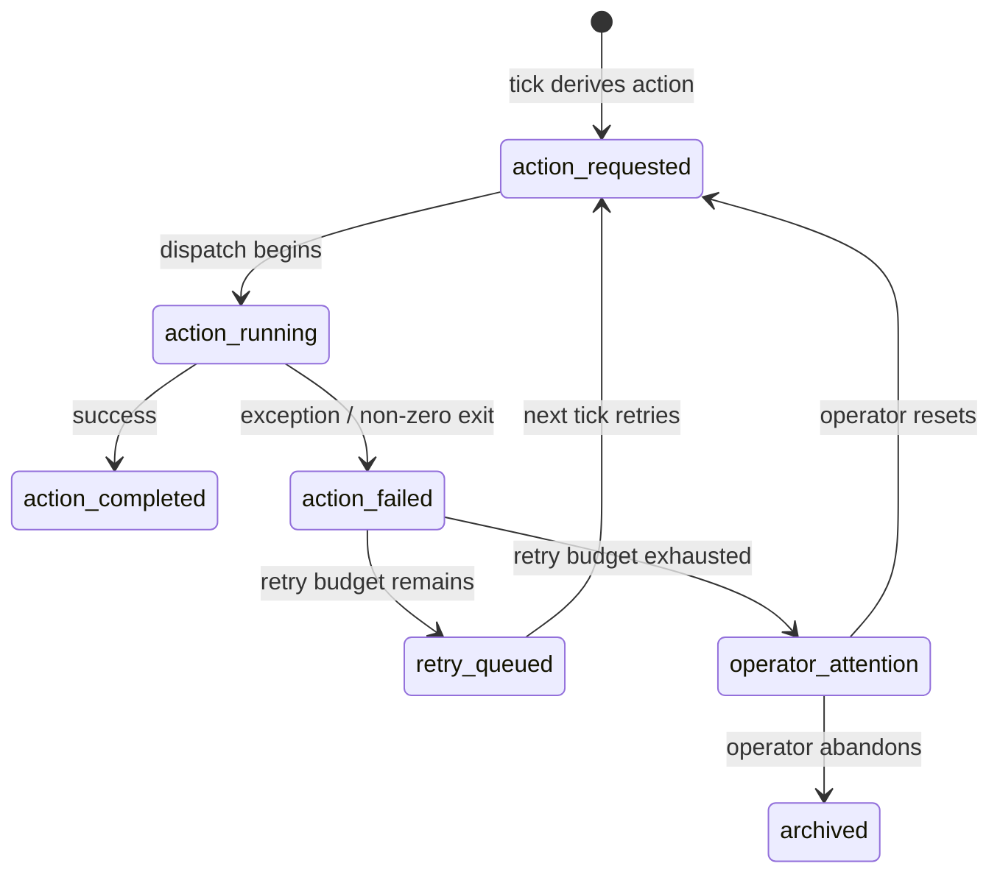

# Failures

Daedalus models failures as **first-class runtime state**, not as log lines to grep later. When an active `change-delivery` action fails, the system persists enough context to decide — automatically or with operator guidance — what happens next.

This page documents the `change-delivery` SQLite action/failure model. Shared engine retry/backoff state now lives in SQLite for both workflows; `memory/workflow-scheduler.json` is a generated scheduler snapshot.

---

## Why explicit failure state matters

Without it, every retry decision becomes guesswork. With it, the system can answer:

- Did this fail before?
- Should we retry?
- Did retry already happen?
- Has this been superseded?
- Are we stuck badly enough to require operator attention?

That is the difference between a durable orchestrator and a deadlocked queue with nice branding.

---

## Failure lifecycle



States with no outgoing arrows (other than terminal `archived`) keep the lane alive — the loop never crashes, only the current attempt.

---

## Schema

### `failures` table (SQLite)

| Field | Type | Meaning |
|---|---|---|
| `failure_id` | string | UUID v4. |
| `lane_id` | string | FK → `lanes.lane_id`. |
| `action_id` | string \| null | FK → `lane_actions.action_id`, if the failure originated from an action. |
| `action_type` | string | e.g. `dispatch_implementation_turn`, `request_internal_review`. |
| `head_sha` | string \| null | Git head the failure occurred against. |
| `error_summary` | string | Human-readable one-liner. |
| `error_detail` | string \| null | Full traceback or stderr. |
| `retry_count` | int | How many times this action has been retried. |
| `max_retries` | int | Configured ceiling (default: 3). |
| `superseded_by` | string \| null | FK → another `failure_id` if this failure was superseded by a later one. |
| `created_at` | timestamp | When the failure was first recorded. |
| `resolved_at` | timestamp \| null | When the lane made forward progress again. |

### `lane_actions` table (relevant columns)

| Field | Type | Meaning |
|---|---|---|
| `action_id` | string | UUID v4. |
| `lane_id` | string | FK → `lanes`. |
| `action_type` | string | Execution action name. |
| `status` | enum | `requested` / `running` / `completed` / `failed`. |
| `retry_count` | int | Incremented on each retry attempt. |
| `idempotency_key` | string | Composite key: `lane_id:action_type:head_sha`. Prevents duplicate active rows. |
| `requested_at` | timestamp | When the action was queued. |
| `failed_at` | timestamp \| null | When the failure was recorded. |
| `completed_at` | timestamp \| null | When success was recorded. |

---

## Idempotency and the lane-220 fix

Two hardening fixes during lane 220 work changed how failures interact with the action queue:

### Fix 1: Failed internal review no longer wedges workflow state

**Before:** `dispatch_internal_review()` failed after marking review `running` in the workflow read model. The lane stayed stuck at `running` forever.

**After:** Failure resets the internal review back to a retryable `pending` state.

### Fix 2: Failed active actions no longer consume the idempotency slot permanently

**Before:** A failed `request_internal_review` action for head `abc123` wrote a `failed` row with idempotency key `lane:220:request_internal_review:abc123`. The next tick saw the key existed and skipped requeue — the lane was deadlocked.

**After:** Failed actions can requeue with an incremented `retry_count`. The idempotency key is relaxed for failed rows: a new active action is allowed if the prior one failed and `retry_count < max_retries`.

---

## Retry policy

Retries are governed by the `change-delivery` escalation policy in `WORKFLOW.md`:

```yaml
escalation:
  lane-failure-retry-budget: 3
  operator-attention-retry-threshold: 5
  operator-attention-no-progress-threshold: 5
```

| Field | Type | Default | Notes |
|---|---|---|---|
| `escalation.lane-failure-retry-budget` | int ≥ 0 | `3` | Number of bounded automatic retries for failed lane actions. |
| `escalation.operator-attention-retry-threshold` | int ≥ 0 | `5` | Retry count that marks a lane as requiring operator attention. |
| `escalation.operator-attention-no-progress-threshold` | int ≥ 0 | `5` | Consecutive no-progress ticks before operator attention. |

`issue-runner` uses a different policy: 1s continuation retries and exponential worker-failure backoff capped by `agent.max_retry_backoff_ms`.

---

## Failure → operator attention

When `retry_count == max_retries`, the lane transitions to `operator_attention_required`. The operator can:

- `/daedalus analyze-failure --failure-id <id>` — see full context
- `/workflow change-delivery tick` — force another attempt (bypasses retry budget)
- Edit the issue / PR to unblock the lane manually
- `/workflow change-delivery pause` — stop processing this lane

---

## SQL debugging

### Show recent failures for a lane

```sql
select failure_id, action_type, head_sha, retry_count, error_summary, created_at, resolved_at
from failures
where lane_id='lane:220'
order by created_at desc;
```

### Show active actions that have failed

```sql
select action_id, action_type, status, retry_count, requested_at, failed_at
from lane_actions
where lane_id='lane:220' and status='failed'
order by failed_at desc;
```

### Count unresolved failures per lane

```sql
select lane_id, count(*) as unresolved
from failures
where resolved_at is null
group by lane_id;
```

---

## Where this lives in code

- Failure tracking: `daedalus/runtime.py` (look for `record_failure`, `resolve_failure`, `retry_eligible`)
- Action queue: `daedalus/runtime.py` (look for `request_active_action`, `action_idempotency_key`)
- Retry logic: `daedalus/workflows/change_delivery/dispatch.py`
- Operator surface: `daedalus/daedalus_cli.py` (`analyze-failure` command)
- Tests: `tests/test_workflows_change_delivery_actions.py`, `tests/test_stall_detection.py`
