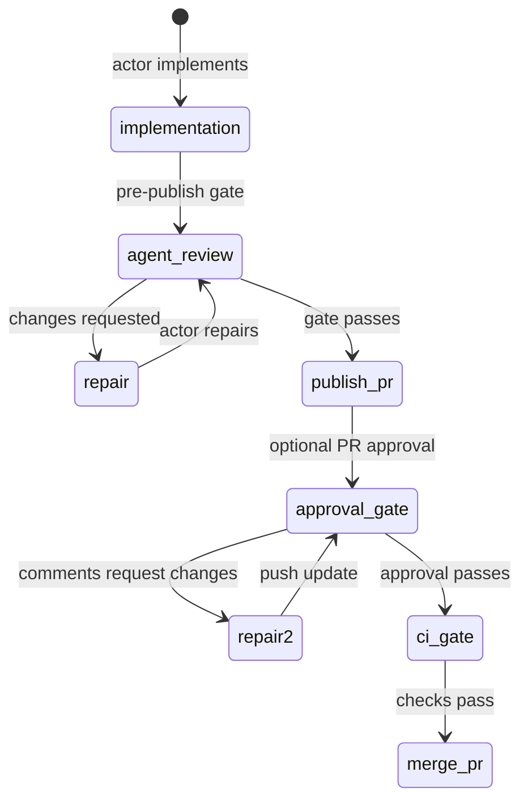

# Reviewers

Daedalus treats review as workflow gates, not as fixed bot names. In
`change-delivery`, an `agent-review` gate can run any configured actor in a
fresh context before publish, while a `pr-comment-approval` gate can wait for
registered PR commenters or reactions before merge. The goal is simple: no code
reaches `main` without passing the gates declared in `WORKFLOW.md`.

---

## Gate types

| Gate | Runtime/source | When active | Blocks |
|---|---|---|---|
| `agent-review` | Any actor runtime (`hermes-agent`, `codex-app-server`, CLI, command) | Before PR publish by default | Publish |
| `pr-comment-approval` | Code-host comments/reactions | After PR is published | Merge when required |
| `code-host-checks` | Code host checks/CI | Before merge | Merge when required |

### Agent review

- **Runtime:** selected by `actors.<name>.runtime`
- **Model:** selected by `actors.<name>.model`
- **Trigger:** local unpublished branch exists and needs the pre-publish gate
- **Output:** JSON verdict with `verdict`, `findings`, `targetHeadSha`
- **Gate:** must pass before PR publish when configured as required

### PR comment approval

- **Runtime:** none; the code-host client reads PR comments/reactions
- **Trigger:** PR exists and `required-for-merge` is true
- **Output:** accepted approval signal such as `+1`
- **Gate:** must pass before merge when configured

---

## Review lifecycle



---

## Findings format

Reviewers return structured findings that the workflow uses for repair handoff:

```json
{
  "verdict": "changes_requested",
  "targetHeadSha": "abc123def...",
  "findings": [
    {
      "file": "src/foo.py",
      "line": 42,
      "severity": 1,
      "message": "Missing error handling for network timeout"
    }
  ],
  "summary": "2 findings, both addressable"
}
```

### Severity levels

| Badge | Meaning |
|---|---|
| `P1` | Critical — blocks merge |
| `P2` | Important — should fix |
| `P3` | Minor — nice to have |

The `SEVERITY_BADGE_RE` regex (`![P(\d+) Badge`) extracts these from review output for aggregation.

---

## Repair handoff

When a review gate returns `changes_requested`, the workflow dispatches a
**repair handoff** back to the implementer actor:

1. Findings are deduplicated against `lane-state.json` handoff metadata
2. New findings are appended to the lane memo
3. Implementer session receives the repair prompt
4. Implementer fixes and commits
5. Review gate re-evaluates the new head

### Deduplication key

```
<target_head_sha>:<finding_file>:<finding_line>:<finding_message_hash>
```

This prevents the same finding from being re-reported after repair.

---

## Review state in SQLite

### `lane_reviews` table

| Field | Type | Meaning |
|---|---|---|
| `review_id` | string | UUID v4 |
| `lane_id` | string | FK → lanes |
| `reviewer_scope` | enum | `internal` / `external` / `advisory` |
| `status` | enum | `pending` / `running` / `completed` |
| `verdict` | enum | `pass` / `pass_with_findings` / `changes_requested` |
| `requested_head_sha` | string | Head the review was requested against |
| `reviewed_head_sha` | string \| null | Head actually reviewed (may differ if pushed mid-review) |
| `findings_count` | int | Number of findings returned |
| `requested_at` | timestamp | When review was dispatched |
| `completed_at` | timestamp \| null | When verdict was received |

---

## SQL debugging

### Show review history for a lane

```sql
select reviewer_scope, status, verdict, requested_head_sha, reviewed_head_sha, findings_count, requested_at, completed_at
from lane_reviews
where lane_id='lane:220'
order by requested_at desc;
```

### Find lanes with open findings

```sql
select l.lane_id, l.issue_number, r.reviewer_scope, r.findings_count
from lanes l
join lane_reviews r on l.lane_id = r.lane_id
where r.verdict = 'changes_requested'
  and r.completed_at is not null;
```

### Check if internal gate blocks publish

```sql
select status, verdict
from lane_reviews
where lane_id='lane:220'
  and reviewer_scope='internal'
order by requested_at desc
limit 1;
```

---

## Where this lives in code

- Review policy: `daedalus/workflows/change_delivery/reviews.py`
- Reviewer implementations: `daedalus/workflows/change_delivery/reviewers/`
- Review dispatch: `daedalus/workflows/change_delivery/dispatch.py`
- Findings parsing: `daedalus/workflows/change_delivery/reviews.py` (look for `_extract_json_object`, `SEVERITY_BADGE_RE`)
- Repair handoff: `daedalus/workflows/change_delivery/actions.py`
- Review state schema: `daedalus/workflows/change_delivery/migrations.py`
- Tests: `tests/test_workflows_change_delivery_reviews.py`, `tests/test_external_reviewer_phase_b.py`
