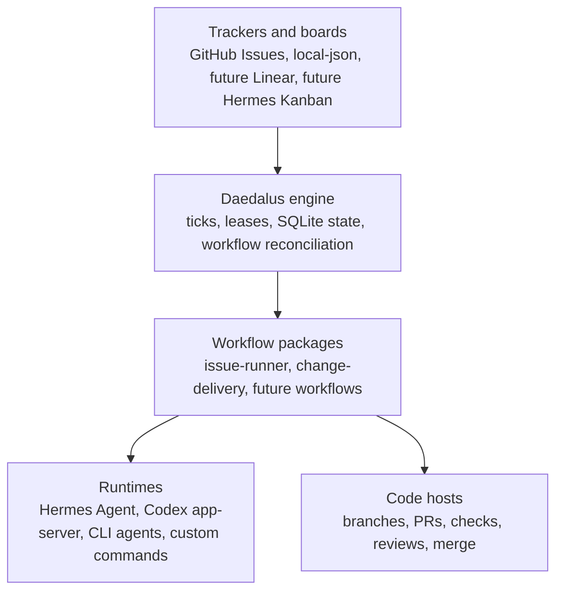

# Daedalus vs. Hermes Agent vs. Hermes Kanban

Daedalus, Hermes Agent, and Hermes Kanban all coordinate agentic work, but they
sit at different layers. Keeping those layers separate avoids duplicate
schedulers and makes Daedalus useful without taking over every Hermes feature.



## Short Version

| System | Primary job | Best fit |
|---|---|---|
| Hermes Agent | Run an agent with tools, memory, skills, models, messaging, and runtime surfaces. | The execution platform Daedalus can call into. |
| Hermes Kanban | Durable multi-agent task board with task states, dependencies, run history, and worker claims. | Optional local-first tracker or planning board. |
| Daedalus | Durable SDLC workflow engine that turns issues into governed workflow runs. | Software delivery automation: issue selection, runtime dispatch, PR/review/merge gates, recovery. |

## Where They Overlap

Hermes Kanban and Daedalus are both engine-like. Both use durable state, track
work attempts, support claim/retry/recovery semantics, and expose operator
surfaces. That overlap is why Kanban should not become Daedalus' internal
scheduler. Running one scheduler inside another would create unclear ownership
for claims, retries, blocked work, and terminal states.

## What Each Does Not Own

| System | Intentional limitation |
|---|---|
| Hermes Agent | It runs agents and exposes tools, but it should not own Daedalus workflow policy, SDLC gates, tracker reconciliation, or PR/merge semantics. |
| Hermes Kanban | It coordinates generic tasks, but it should not own Daedalus lane leases, runtime role dispatch, GitHub PR lifecycle, CI/review gates, or workflow recovery policy. |
| Daedalus | It automates SDLC workflows, but it should not become a general personal/team Kanban board, messaging gateway, model provider router, or universal Hermes task UI. |

## Why Daedalus Is Not Duplication

Hermes Kanban can say: "task X is ready and assigned to profile Y." Daedalus
adds the SDLC-specific layer: "issue X becomes a lane, role A uses runtime B,
thread IDs are persisted, tracker feedback is posted, a PR is created or
updated, review gates are enforced, CI and merge state are reconciled, and
stalled work is recovered."

That SDLC layer is the reason Daedalus remains necessary even when Hermes
Kanban exists.

## Integration Stance

Hermes Agent should remain a first-class runtime surface. Daedalus should call
it through runtime adapters such as `hermes-agent` and, later, optional
`hermes-acp`.

Hermes Kanban should be integrated later as a tracker adapter, not as a
replacement engine:

```yaml
tracker:
  kind: hermes-kanban
  tenant: my-project
  assignee: daedalus
```

In that shape, Daedalus reads candidate tasks from Kanban and writes comments or
state updates back, while Daedalus still owns workflow execution, leases,
runtime dispatch, gates, reconciliation, and code-host side effects.

## Current Priority

Keep GitHub first-class for `change-delivery` because GitHub is where issues,
branches, PRs, reviews, checks, and merge state already live. Add Hermes Kanban
later for local demos, personal task queues, non-GitHub work, and fleet-style
operator planning.

References:

- [Hermes Agent ACP integration](https://hermes-agent.nousresearch.com/docs/user-guide/features/acp)
- [Hermes Kanban overview](https://hermes-agent.nousresearch.com/docs/user-guide/features/kanban)
- [Hermes Kanban tutorial](https://hermes-agent.nousresearch.com/docs/user-guide/features/kanban-tutorial)
